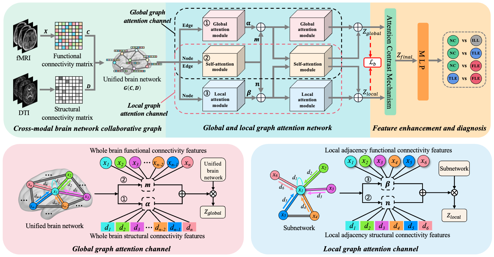

# Collaborative Graph Convolutional Networks for Cross-Modal Brain Network Analysis
[](https://www.python.org/downloads/)     [](https://pytorch.org/)

Official codes for paper "Collaborative Graph Convolutional Networks for Cross-Modal Brain Network Analysis"


## Overview


This project implements a **Global-Local Graph Attention Network (GLGATN)** framework for brain network analysis, specifically designed for brain disorder classification tasks. The method integrates functional connectivity from fMRI and structural connectivity from DTI data, leveraging attention mechanisms and contrastive learning to enhance classification performance.

## Recommended System Configurations
- Python >= 3.8
- Pytorch 1.13.1 + cu116
- GPU with at least 12GB memory
- networks 2.8.4
- numpy 1.24.2
- scipy 1.10.1
- scikit-learn 1.2.1

## Datasets
- [ADNI](https://adni.loni.usc.edu/ "Alzheimer's Disease Neuroimaging Initiative")


## Data Preparation

#### Required Data Files
1. Place fMRI data file `ADNI_fmri.mat` in `data/raw/` directory
2. Place DTI data file `ADNI_dti.mat` in `data/raw/` directory

#### Data Format Requirements
- **fMRI Data**: Functional connectivity matrices with shape [n_subjects, n_regions, n_regions]
- **DTI Data**: Structural connectivity matrices with shape [n_subjects, n_regions, n_regions]  
- **Labels**: Binary labels (0 for Normal Control, 1 for Patient)

#### Data Structure
```
data/
├── raw/
│   ├── ADNI_fmri.mat    # fMRI functional connectivity
│   └── ADNI_dti.mat        # DTI structural connectivity
└── processed/            # Preprocessed data (auto-generated)
```

## Dataset Pre-processing
Pre-process the fMRI and DTI as mentioned in the section IV. Experiments-A. Materials.

## Project Structure and Usage

This project is organized into several modules: `config/` contains configuration files for model parameters, `data/` handles data loading and preprocessing with the main data loader in `data_loader.py`, `models/` contains the GLGAT model implementation in `glgat.py`, `training/` includes the training pipeline in `trainer.py`, `utils/` provides logging and seed management utilities, and `results/` stores training outputs and model checkpoints.

To use this code, first place your fMRI data file `ADNI_fmri.mat` and DTI data file `ADNI_dti.mat` in the `data/raw/` directory, then simply run `python main.py` to start training - the system will automatically load the data, initialize the GLGAT model, perform training with the configured parameters, and save results in the `results/` directory. You can modify training parameters like learning rate, batch size, and number of epochs in `config/config.py` before running.

## Citation
If you use this code, please cite the corresponding paper: (unavailable now)

